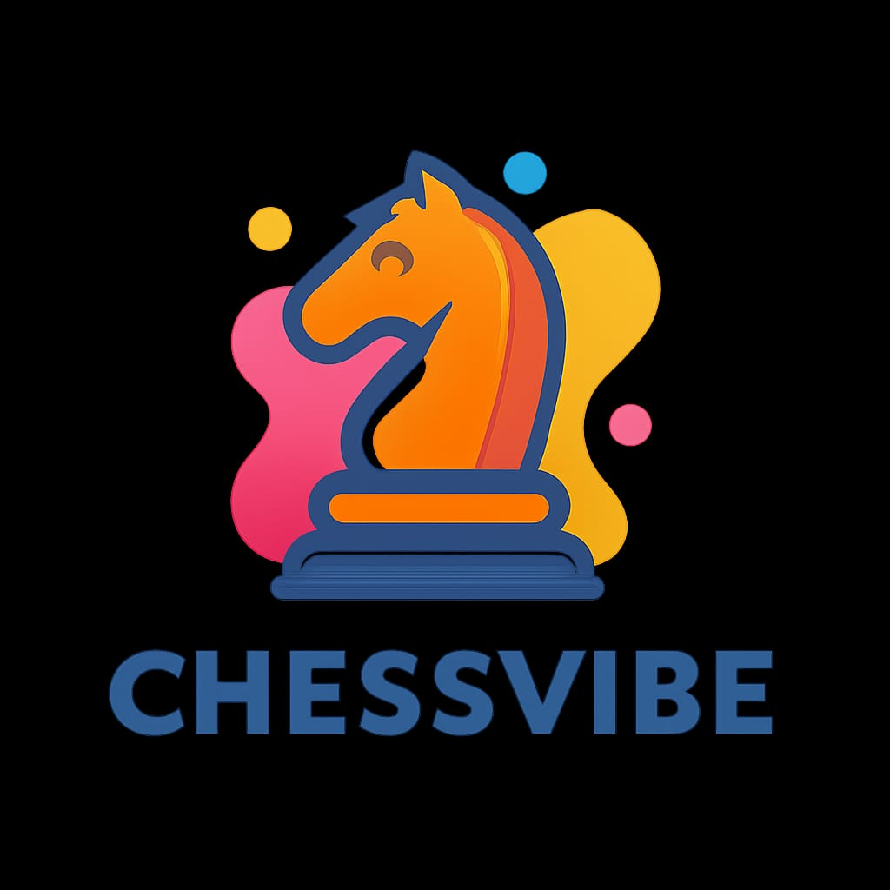

<p align="center">
  <a href="https://chess-vibe.vercel.app">
    
  </a>
</p>

<h1 align="center">ChessVibe</h1>

<p align="center">
  <strong>A polished, zero-dependency chess web app with real-time P2P multiplayer, Stockfish AI, and Wikipedia-style SVG pieces.</strong>
</p>

<p align="center">
  <a href="https://github.com/vincenzo-afk/Chessvibe/blob/main/LICENSE"></a>
  <a href="https://github.com/vincenzo-afk/Chessvibe"></a>
  <a href="https://github.com/vincenzo-afk/Chessvibe/issues"></a>
  <a href="https://chess-vibe.vercel.app"></a>
  <a href="https://github.com/vincenzo-afk/Chessvibe/stargazers"></a>
</p>

---

## 🌟 Overview

ChessVibe is a modern, high-performance chess platform designed for seamless play across all devices. Built with a focus on simplicity and power, it offers a range of modes from local matches to real-time online multiplayer using PeerJS. The UI is inspired by Notion's clean, flat aesthetic, providing a distraction-free environment for strategic thinking.

## 🚀 Features

- ♟ **Real-Time Multiplayer:** Play with friends anywhere in the world using PeerJS for low-latency, peer-to-peer connectivity. No registration required—just share a room code.
- 🤖 **Stockfish AI:** Challenge yourself against the world-class Stockfish engine, with 15 adjustable difficulty levels to suit players of all skill ranges.
- 👁 **Spectator Mode:** Unlimited read-only viewers can join a live game.
- 🕐 **Chess Clocks:** Bullet, blitz, and rapid presets with Fischer increment support.
- 🖱 **Drag & Drop + Touch:** Full mouse and touch piece dragging with legal-move highlighting, plus click-to-move.
- 📊 **Game Analysis:** End-of-game accuracy bars, average think time, and a full replay engine to review every move.
- 🖼 **Wikipedia-Style Visuals:** High-quality SVG pieces and a classic green/cream board theme for a professional look and feel.
- ☀ **Notion-Inspired UI:** A beautiful, responsive, and minimal interface that looks great on desktop and mobile.
- 🔍 **SEO Optimized:** Fully optimized for search engines with meta tags, Open Graph support, and structured data.
- 📦 **Zero Dependencies:** A lightweight, vanilla JavaScript implementation that requires no complex setup or installation.

## 🛠️ Technology Stack

- **Frontend:** Vanilla JavaScript, HTML5, CSS3 (Notion-style Flat UI)
- **Game Logic:** [chess.js](https://github.com/jhlywa/chess.js) for move validation and game rules.
- **Multiplayer:** [PeerJS](https://peerjs.com/) for WebRTC-based peer-to-peer communication.
- **AI Engine:** [Stockfish.online API](https://stockfish.online/) for high-level analysis and play.
- **Deployment:** Vercel / GitHub Pages.

## 📦 Getting Started

### Prerequisites

No complex prerequisites are needed. Just a modern web browser.

### Local Development

1. **Clone the repository:**
   ```bash
   git clone https://github.com/vincenzo-afk/Chessvibe.git
   cd Chessvibe
   ```

2. **Run a local server:**
   You can use any static file server. For example, using Python:
   ```bash
   python3 -m http.server 8000
   ```

3. **Open in your browser:**
   Navigate to `http://localhost:8000`.

## 📈 SEO & Performance

ChessVibe is built with performance and discoverability in mind:
- **Lighthouse Score:** Optimized for 90+ in all categories.
- **Meta Tags:** Comprehensive SEO tags for all major social platforms.
- **Favicons:** Custom high-resolution icons generated from the project logo.
- **Sitemap & Robots:** Automated sitemap and robots.txt for better indexing.

## 🤝 Contributing

Contributions are welcome! Whether it's fixing a bug, adding a feature, or improving documentation, feel free to open an issue or submit a pull request.

1. Fork the Project
2. Create your Feature Branch (`git checkout -b feature/AmazingFeature`)
3. Commit your Changes (`git commit -m 'Add some AmazingFeature'`)
4. Push to the Branch (`git push origin feature/AmazingFeature`)
5. Open a Pull Request

## 📄 License

Distributed under the MIT License. See `LICENSE` for more information.

## 📬 Contact

vincenzo-afk - [GitHub](https://github.com/vincenzo-afk)

Project Link: [https://github.com/vincenzo-afk/Chessvibe](https://github.com/vincenzo-afk/Chessvibe)

---

<p align="center">
  Made with ❤️ for the chess community.
</p>
